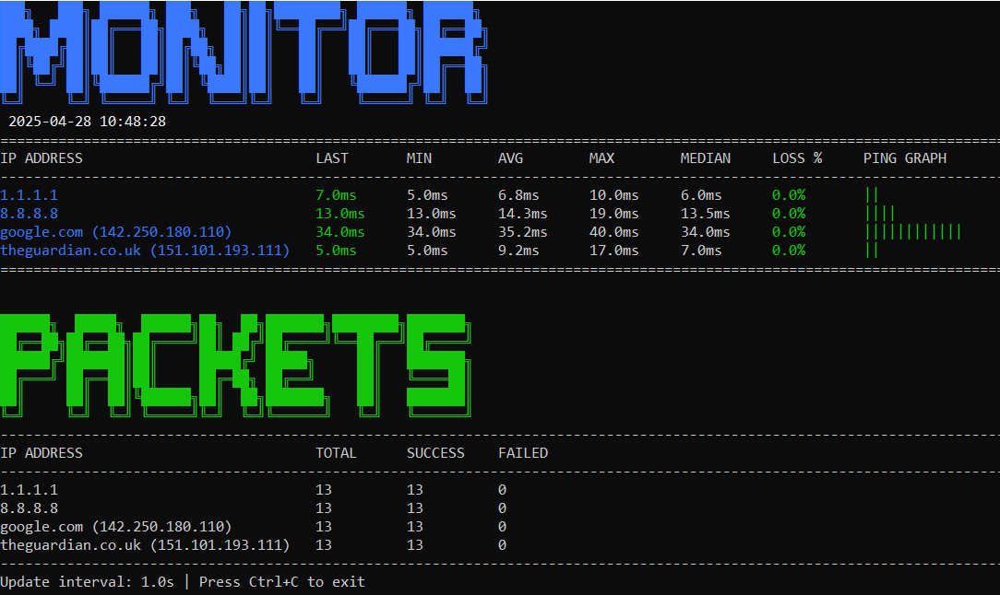

# multi_pingpong

Ping Monitor is a Python script that enables for pinging multiple IP addresses or domains simultaneously, displaying real-time latency statistics, packet loss, and a visual ping graph in a terminal-based dashboard.

## Feature list

- Ping multiple IPs or domains concurrently.

- Display real-time statistics: last ping, minimum, average, maximum, median latency, and packet loss percentage.

- Visual ASCII graph that represents latency.

- Alerts for high packet loss or latency.

- Read IP's from file.

- Support for **Linux/Windows/MacOS**

## Installation

**Tested on Python 3.12** 

Check the current python version with

`python3 --version`

If not installed, it can be installed with package manager of Linux e.g

`sudo apt intall python3`

On Windows download from python.org

## Suggested setup

### Download the script

1. Clone the repo

`git clone https://github.com/StoreA/multi_pingpong.git`  
`cd multi_pingpong`

2. Make the script executable (Linux/MacOS)

`chmod +x multi_pingpong.py`

### Create alias for .bashrc or .zshrc

1. Change the .bashrc configuration file

`nano ~/.bashrc`

2. Map an alias to the script for easy use

Go to the bottom of the configration file and add

`alias pinger='python3 path/to/multi_pingpong.py'`

3. Source the .bashrc for changes to take effect

`source ~/.bashrc`

## Usage

### Running
Script can be run from command line, specifying IP's, domains or .txt files containing list of IP's

Raw command line 

`pinger 1.1.1.1 8.8.8.8 google.com theguardian.co.uk`

-f, From file containing list of IP's 

`pinger -f list_of_ips.txt`

*Note: The -f option ONLY allows one ip per line for now, update will follow.*
*Note: Specifying a range of IP's will come.*

### Intended usage

Troubleshooting networks with bunch of known IP addresses, start the program and continue setup or troubleshooting while getting live updates.
Getting rid of having to have multiple temrinals, and single ping request for each device. 

